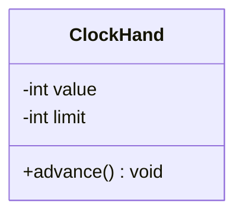

# Java Programming Langauge

## Lập trình hướng đối tượng là gì 

Lập trình hướng đối tượng là tạo ra sự trừu tượng, ở đây thay vì chỉ ra chi tiết cách thức hoạt động bên của chúng thì ta sẽ tách các khái niệm thành các thực thể riêng thể riêng biệt.

## Object và Class 

**Class** xác định thuộc tính của đối tượng, thức là các thông tin liên quan tới chúng (các biến instance) và các hành vi của chúng (method), nó không đại diện cho một thực thể cụ thể.

- **Method** thường dùng để sử đổi trạng thái bên trong đối tượng được khởi tạo từ class.

**Object** là một thể hiện của class (instance of), tức là các trạng thái riêng và có thể thực thi hành vi được định nghĩa trong class. Điều này có nghĩa là nhiều Object có cùng một Class nhưng state khác nhau.

Về mặt ngôn ngữ, một đối tượng được tạo ra bằng cách gọi một `constructor` - hay còn gọi là hàm tạo, từ khóa để gọi `constructor` là `new` - Java Programming Language.

> [!NOTE] Mối quan hệ giữa Class và Object
> 
> Một Class sẽ đưa ra bản thiết kế (blueprint) chi tiết cho bất kì đối tượng nào được tạo ra từ nó.
>
> Những thực thể cụ thể được tạo ra Class đều được gọi là thể hiện cùng một lớp (instance of the same class).
>
> Tuy nhiên, trạng thái của chúng có thể khác nhau. Ví dụ như cùng là một chiếc ô tô nhưng động cơ khác nhau và hình dáng cũng sẽ khác nhau.

### Object có mấy loại 

Nhắc sơ lại về khái niệm đối tượng, đối tượng là một thực thể độc lập có trạng thái và sử dụng hành vi được định nghĩa trong Class. 

Đối tượng có nhiều dạng khác nhau nhưng ta chia ra làm hai loại chính. Một là môt tả khái niệm vấn đề, hai là điều phối sự tương tác giữa các đối tượng - hay còn gọi là thực thể trung ương.

Ta có thuật ngữ chuyên ngành là:

- **Entity/Domain Object**: Chứa dữ liệu và nghiệp vụ cốt lõi.
- **Controller/Service Object**: Điều phối các đối tượng khác để thực hiện một luồng công việc.

Tôi có cấu trúc thư mục như sau 

```bash
Clock Program
├─ seconds (ClockHand)
├─ minutes (ClockHand)
└─ hours   (ClockHand) 
```

Ở đây, ta có hai đối tượng, `ClockHand` và Clock`. `ClockHand` là một Object mô tả khái niệm vấn đề, nó cung cấp biến instance là limit và method `advance()` để `Clock` điều phối sự tương tác giữa chúng.

Vậy tại sao ta phải làm như vậy thay vì tạo ra một cái đồng hồ và viết toàn bộ logic bên trong ?

Điều đầu tiên ta phải nói đến là tái sử dụng và tính modun. Nếu ta cho một đồng hồ cứng nhắc là 24h và 60s theo hệ số của trái đất, thì nó sẽ không đúng với các không thời gian khác trong vũ trụ, ta tạo ra các thực thể khác nhau để sử dụng được với mọi tình huống khác nhau

Về mặt Object, ta phân rã chúng khi tạo ra một instance cụ thể, nhưng ở Class, ta gom nó chung lại để thực hiện một hành động cụ thể. Có nghĩa là Object có các hành vi như nhau, nhưng quy luật và trạng thái giữa chúng là khác nhau.

Về tổng thể, mỗi đối tượng có ranh giới và hành vi riêng của mình.  

### Thiết kế Class thế nào?

### Responsibility

### Mối quan hệ has-a

### Ownership và Lifetime của một đối tượng 

Một Object được coi là sở hữu dữ liệu khi trường đó nằm trong nó, nó kiểm soát được việc thay đổi dữ liệu và đảm bảo dữ liệu luôn hợp lệ.

Tôi có ví dụ như sau:



Trong `Clock` Program kia, `ClockHand` có hai trường là `value` và `limit`, câu hỏi đặt ra là `Clock` có sở hữu `value` và `limit` không?

Câu trả lời là không, vì `Clock` không sở hữu trực tiếp `value` và `limit`. Nó chỉ có quyền tương tác thông qua `method`.

**Ownership** không phải là ai chứa ai, mà là ai kiểm soát và chịu trách nhiệm cho dữ liệu. Trong OOP, ownership chỉ tính ở nơi dữ liệu được định nghĩa và kiểm soát.

`ClockHand` đảm bảo `0 <= value < limit` $\rightarrow$ invariant. Nói đúng hơn là chúng có quan hệ nhân quả chặt chẽ. Có thể hiểu đơn giản: Ownership là "quyền lực", còn Invariant là "luật lệ".

#### Invariant

**Invariant** là một điều kiện hoặc một quy luật mà luôn luôn phải đúng trong vòng đời của một đối tượng. Điêu này có nghĩa là:

- Nó phải đúng trước khi đối tượng được khởi tạo. (Invariant bắt đầu có hiệu lực khi constructor được chạy xong).
- Nó phải đúng trước và sau khi bất kỳ phương thức nào được thực thi

> [!NOTE]
> `Encapsulation` giúp bảo vệ `Invariant`
>
> `Encapsulation` đảm bảo rằng dữ liệu chỉ có thể thay đổi theo cách mà người lập trình thiết kế


#### Runtime là gì

#### Object LifeCycle

### High cohesion và Low-coupling

### Invariant và Encapsulation

## Constructor

### Default Constructor

### `this` keyword

### Constructor overloading

### Overload là gì

