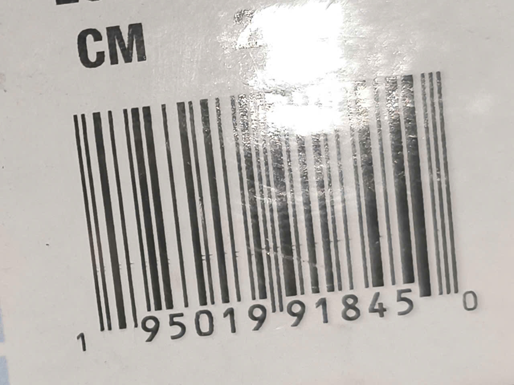

# Barcode là gì

**Barcode** hay còn gọi là mã vạch, nó được in trên hầu hết mọi loại sản phẩm, bao bì được bày bán tại các trung tâm bán lẻ và trung tâm thương mại.

Nội dung mã vạch bao gồm: nước đăng ký mã vạch, tên doanh nghiệp, lô, tiêu chuẩn, chất lượng đăng ký, thông tin về kích thước sản phẩm, nơi kiểm tra...

## Lịch sử

Ý tưởng này được phát triển bởi _Norman Joseph Woodland_ và _Bernard Silver_. Nó được phát triển khi biết mong muốn của một vị chủ tích buôn bán đồ ăn làm sao để tự động kiểm tra toàn bộ quy trình. Ý tưởng đầu tiên là sử dụng mã Morse để in những vạch rộng hay hẹp thẳng đứng. Sau đó, họ chuyển sang sử dụng dạng "điểm đen" của mã vạch với các vòng tròn đồng tâm. Ngày 7 tháng 10 năm 1952, công trình _Classifying Apparatus and Method_ đã được cấp bằng sáng chế.

## Nguyên lý nhị phân

Về cơ bản, mã vạch là sự tương phản giữa các vạch đen và khoảng trắng để máy quét có thể đọc và chuyển thành số.

- Vạch đen là số 0 hoặc 1 - tùy quy ước, hấp thụ ánh sáng mạnh, phản xạ yếu.
- Vạch trắng cũng tùy quy ước, phản xạ lại ánh sáng mạnh.

Module: Mỗi mã vạch được chia thành các đơn vị nhỏ nhất được gọi là module. Một vạch dày thực chất là nhiều module đứng cạch nhau. Vạch mỏng là module đơn lẻ.

### Cách mã hóa

Cách mã hóa dưới đây đang sử dụng mã UPC, đây là mã thường thấy trên siêu thị, mỗi số từ 0 đến 9 được biểu diễn bằng chuỗi 7 bit nhị phân:

- Số 0 được mã hóa bằng `0001101`
- Số 1 được mã hóa bằng `0011001`

Mỗi chuỗi luôn có 2 vạch đen và hai vạch trắng khác nhau với độ dày khác nhau để máy quét nhận diện

Ví dụ, đôi giày **Sauconny Peregrine 14** có mã vạch như sau:

> 
>
> Dịch tương ứng sẽ là
>
> 101 0011001 0001011 011001 0001101 0011001 0001011 01010 1110100 1100110 100100 1010000 1001110 1110010 101

## Cấu tạo

Tôi sẽ sử dụng chuẩn phổ biến là EAN-13 để phân tích cấu tạo của chúng.

- Mã quốc gia (3 số đầu): được quy định bởi tổ chức GS1 tại quốc gia đó cung cấp cho từng nhà sản xuất cụ thể. Mỗi công ty sẽ có một mã riêng không trùng lặp.

- Mã doanh nghiệp (4 đến 6 số tiếp theo): do tổ chức GS1 tại quốc gia đó cấp cho từng nhà sản xuất cụ thể. Mỗi công ty sẽ có một mã công ty riêng biệt không trùng lặp

- Mã mặt hàng (3 đến 5 số tiếp theo): do chính doanh nghiệp tự quy định cho từng sản phẩm của mình. Mỗi loại sản phẩm, kích cỡ hay hương vị khác nhau sẽ có một mã riêng để quản lý tồn kho.

- Số kiểm tra (1 số cuối cùng): Dùng để kiểm tra thông qua thuật toán modulo 10 - xem thêm tại mục tiếp theo.

Về tổng quan, mã vạch có các vạch dài và vạch ngắn, nhưng nó có điểm chung là vạch dài nằm ở đầu, giữa và cuối, các vạch này gọi gọi là vạch bảo vệ.

Vạch giữa còn có tính năng khác là chia mã vạch làm hai nửa - Central Guard Bars

Vạch phân cách là hai vạch mảnh dài hơn đầu và vạch giữa, giúp máy quét xác định điểm bắt đầu, điểm kết thúc và tâm mã vạch - Normal Guard Bars.

## Tính hợp lệ của dãy số

Tôi sẽ sử dụng chuẩn phổ biến là EAN-13 sử dụng thuật toán modulo 10 để xác định.

Số thứ 13 trong dãy mã vạch còn được gọi là số kiểm tra, con số này được dựa trên nguyên tăc sau.

Bước 1: cộng tất cả các vị trí ở số lẻ - bắt đầu tính từ số 1.

Bước 2: cộng tất cả các chữ số ở vị trí chẵn rồi nhân với 3 - không tính số kiểm tra.

Bước 3: Tính tổng hai của hai kết quả trên.

Bước 4: Lấy số dư của S khi chia sư cho 10

Bước 5: Kết quả chia dư sẽ có hai trường hợp như sau.

- Nếu kết quả chia dư trước bằng 0, thì số thứ 13 phải bằng 0

- Nếu kết quả chia dư khác 0, thì số kiểm tra sẽ bằng 10 - kết quả chia dư.

> [!CAUTION]
> Thuật toán Modulo 10 chỉ có nhiệm vụ phát hiện lỗi nhập liệu/quét lỗi.

## Thông tin thêm

- Mỗi loạn hàng hóa chỉ có một dãy số duy nhất và ngược lại, mỗi dãy số chỉ đại diện cho một loại hàng hóa.

- Không mang thông tin đặc điểm của sản phẩm, nó không chữa thông tin gì về giá cả, màu sắc hay chất liệu mà chỉ là ánh xạ để giúp máy tính truy xuất cơ sở dữ liệu.

- Hệ thống GS1 là tổ chức toàn cầu chịu trách nhiệm cấp và quản lý mã vạch và số mã vạch để tránh trùng lặp và rủi ro pháp lý.

- Xác xuất trùng lặp là 0%, vì GS1 sẽ linh hoạt độ dài. Nếu doanh nghiệp có ít sản phẩm, thì có thể mã sẽ thu gọn còn 2 số. Nếu doanh nghiệp lớn thì sẽ được cấp 4 số để có quỹ sản phẩm khổng lồ.

- Theo quy định mới nhất của GS1 (từ năm 2019), đối với hầu hết các mặt hàng tiêu dùng, một khi mã GTIN đã được cấp thì không được phép tái sử dụng nữa để tránh xung đột dữ liệu trong thương mại điện tử vĩnh viễn.

- Tiền tố được GS1 cung cấp phải đóng tiền để sử dụng, nếu tự ý lấy mã, công ty sẽ bị phạt vì vi phạm sở hữu trí tuệ và gia lận thương mại.

- Có hàng triệu mã đang tồn tại ngoài kia còn có tên gọi là GTIN (Global Trade Item Number).
